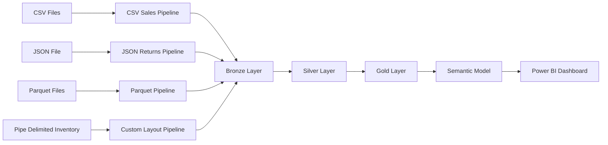

# Architecture Diagram — Mermaid

```mermaid
flowchart LR
    A[CSV Files] --> P1[CSV Sales Pipeline]
    B[JSON File] --> P2[JSON Returns Pipeline]
    C[Parquet Files] --> P3[Parquet Pipeline]
    D[Pipe Delimited Inventory] --> P4[Custom Layout Pipeline]
    P1 --> BR[Bronze Layer]
    P2 --> BR
    P3 --> BR
    P4 --> BR
    BR --> SV[Silver Layer]
    SV --> GD[Gold Layer]
    GD --> SM[Semantic Model]
    SM --> BI[Power BI Dashboard]
```
